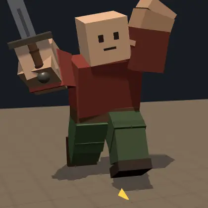
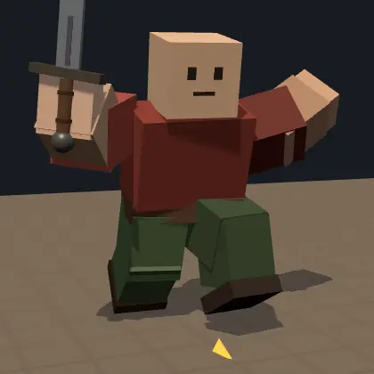
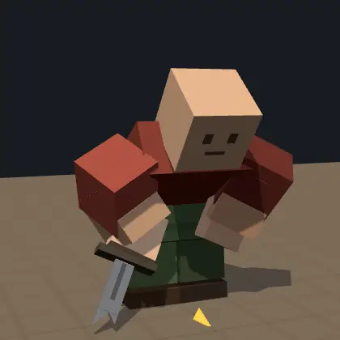
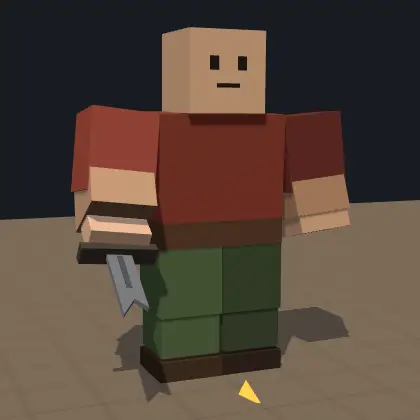
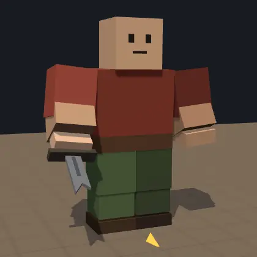
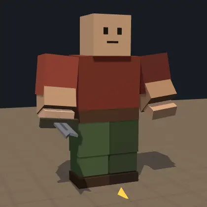
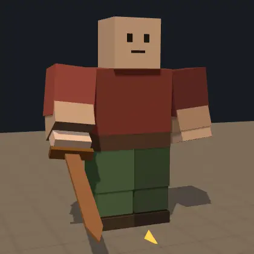
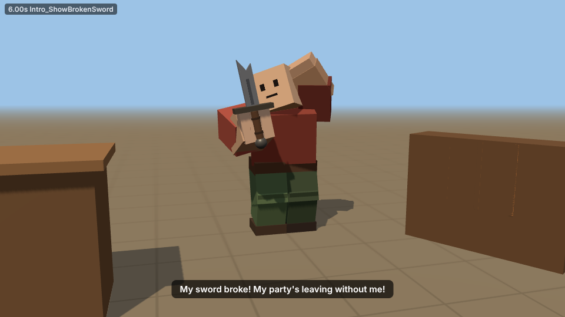
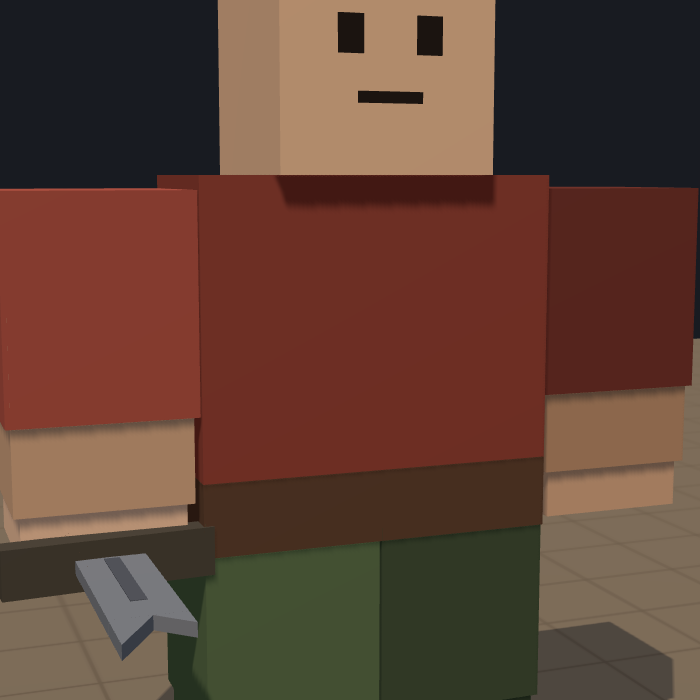

# Intro cutscene assets: "My Sword Broke!"

Everything from the **Effects and Asset Request** except the audio (dropped by request):

| Asset | What it is | File |
|---|---|---|
| `Intro_BrokenSword` | Low-poly broken sword made from ordinary Parts, so there's nothing to upload. The pivot sits at the grip. | `roblox/Intro_BrokenSword.rbxm` |
| `Intro_BrokenSwordTool` | The same sword as a Tool, with `Tool.Grip` already set | `roblox/Intro_BrokenSwordTool.rbxm` |
| `Intro_RunDust` | Beige footstep dust puffs (Attachment with a ParticleEmitter) | `roblox/Intro_RunDust.rbxm` |
| `Intro_SkidDust` | Brief, low dust burst for the stop | `roblox/Intro_SkidDust.rbxm` |
| Animations | 8 R15 `KeyframeSequence`s you can edit and publish | `roblox/Intro_Animations.rbxm` |
| **Everything** | All of the above, plus the `IntroKit` helper module and a demo script | `roblox/IntroAssets.rbxm` |

## Animations (R15)

| Animation | Length | Loops | What happens |
|---|---|---|---|
|  `Intro_PanicRun` | 0.56 s | yes | Panicked in-place run: big strides, left arm flailing overhead, broken sword waved up high. Play while `Humanoid:MoveTo` moves the actor (WalkSpeed 18–20). |
|  `Intro_ArriveStop` | 1.5 s | no | Plants a foot and skids, leaning back with arms flung out, wobbles forward, then settles hunched and winded. |
|  `Intro_CatchBreath` | 1.3 s | yes | Bent over, hands on knees, two heaving breaths per loop. |
|  `Intro_ShowBrokenSword` | 3.8 s | no | Raises the broken sword in front of the face, stares at it, wiggles it, then turns to the player with a pleading open hand. |
|  `Intro_SlumpNotice` | 3.0 s | no | Shoulders slump and the sword droops, then the head snaps to the actor's **left** with a hopeful perk-up. |
|  `Intro_SlumpNoticeRight` | 3.0 s | no | A mirror of the above, for a display on the actor's **right**. |
|  `Intro_PointShelf` | 2.4 s | no | Wind-up, an emphatic left-hand point straight ahead, excited bounces, then a sword-arm pump. |
|  `Intro_Thanks` | 3.0 s | no | Relieved exhale, hand on heart and a bow, then raises the new sword overhead and settles. |

All are R15 `KeyframeSequence`s with `Action` priority, authored for HipHeight 2. Every joint is keyed
on every keyframe, with CubicV2 or Linear easing. Contact sheets (front and side views) are in
`previews/anims/*.png`.

Durations add up to the 14-second opening: PanicRun (~1.5 s) → ArriveStop (1.5 s) → CatchBreath
(~1.5 s) → ShowBrokenSword (3.8 s) → SlumpNotice (3.0 s) → PointShelf (2.4 s).

## The whole opening

[`previews/Opening_animatic.mp4`](previews/Opening_animatic.mp4) plays the animations on your 14-second
timeline: run in, skid, catch breath, show the sword, slump and notice, turn and point. It uses
Roblox-style crossfades, a simple stall set and subtitles. The timeline lives in
`tools/introgen/sequences/Opening.json`, so you can try other timings there before scripting the real
cutscene.



## Quick start

1. In Studio, right-click **ReplicatedStorage > Insert from File…** and pick `roblox/IntroAssets.rbxm`.
2. **Try it.** Build an R15 rig (Avatar tab > Rig Builder > R15), rename it `IntroActor` and move it into
   ReplicatedStorage. Then move `IntroAssets > IntroDemo` into StarterPlayer > StarterPlayerScripts and
   press Play. The demo plays the whole opening in front of you. It works before you publish anything,
   because in Studio IntroKit registers the bundled KeyframeSequences as temporary animations.
3. **Publish the animations** (needed for live servers, see below), paste the ids into
   `IntroAssets > IntroKit > AnimationIds`, and move `IntroDemo` back out of StarterPlayerScripts.

## Using IntroKit in your cutscene controller

```lua
local IntroKit = require(ReplicatedStorage.IntroAssets.IntroKit)

local sword = IntroKit.AttachProp(actor, "Intro_BrokenSword")   -- welded at RightGripAttachment
local dust = IntroKit.AttachDust(actor)                         -- dust under each foot + skid dust

local run = IntroKit.Play(actor, "Intro_PanicRun")              -- looping; puffs dust on each footstep
IntroKit.BindEffects(run, dust)
humanoid:MoveTo(stopPoint)

local stop = IntroKit.Play(actor, "Intro_ArriveStop")           -- "Skid" marker bursts the skid dust
IntroKit.BindEffects(stop, dust)
stop:GetMarkerReachedSignal("Skid"):Wait()                      -- stop moving the actor here
stop:GetMarkerReachedSignal("Stop"):Wait()
IntroKit.Play(actor, "Intro_CatchBreath")
-- ... Intro_ShowBrokenSword, Intro_SlumpNotice / Intro_SlumpNoticeRight, Intro_PointShelf, later Intro_Thanks

IntroKit.Cleanup(actor)                                         -- on Skip, respawn, disconnect or error
```

- `IntroKit.Play(character, name, {fadeTime, speed, weight, hold, exclusive})` returns the AnimationTrack,
  or `nil` if the animation isn't available, so your cutscene can fall back to static poses. It
  crossfades from whatever intro animation was playing. Non-looping animations **hold their last
  frame** until the next one starts (pass `hold = false` to let them end).
- `IntroKit.AttachProp(character, "Intro_BrokenSword")` works on R15 (RightHand) and R6 (Right Arm). It
  uses the same grip a Tool would, so the blade lines up with any animation made for tools.
- `IntroKit.AttachDust(character)` returns `dust:Footstep("Left"|"Right")`, `dust:Skid(scale)`,
  `dust:SetRunning(on)` and `dust:Destroy()`. `IntroKit.Settings.DustQuality` scales every burst; set
  it to 0 to turn dust off.
- `IntroKit.Cleanup(character)` stops the intro animations and removes every prop and effect IntroKit
  added.
- Run IntroKit on the **client that watches the cutscene** (each newcomer gets their own actor). Its
  `Emit` bursts are local, and so are the Studio-only temporary animation ids.
- The game turns the actor to face the shelf before `Intro_PointShelf`; the point goes straight ahead.
  Use `Intro_SlumpNotice` when the display is on the actor's left, or `Intro_SlumpNoticeRight` when
  it's on their right.

### Markers

| Marker | In | Fires when | Suggested use |
|---|---|---|---|
| `FootstepL`, `FootstepR` | Intro_PanicRun | a foot lands | `BindEffects` puffs run dust from that foot |
| `Skid` | Intro_ArriveStop (0.1 s) | the front foot plants | `BindEffects` bursts skid dust; stop moving the actor |
| `Stop` | Intro_ArriveStop (1.5 s) | they come to rest | start `Intro_CatchBreath` |
| `Raise` | Intro_ShowBrokenSword (0.16 s) | the sword starts coming up | |
| `Clink` | Intro_ShowBrokenSword (1.46 s) | the broken blade is wiggled | blade glint (and a clink, if you add audio later) |
| `LookAtPlayer` | Intro_ShowBrokenSword (2.0 s) | they turn back to the player | second subtitle line |
| `Slump` | Intro_SlumpNotice (0.3 s) | shoulders drop | |
| `Notice` | Intro_SlumpNotice (1.48 s) | they spot the display | "Please tell me you have another one…" |
| `Point` | Intro_PointShelf (0.44 s) | the point lands | highlight the shelf |
| `Bow`, `Cheer` | Intro_Thanks (1.2 s, 1.95 s) | the bow, raising the new sword | |

## Publishing the animations (to get ids)

Animations have to be owned by the account or group that owns the experience, so publish them from
that account. For each KeyframeSequence in `IntroAssets > Intro_Animations`, either:

- **Right-click it > Save to Roblox…**, pick the owner (you or your group), and publish. Or:
- Put a copy in **ServerStorage > RBX_ANIMSAVES > (your rig's name)**. Open the rig in the
  **Animation Editor**, choose **… > Load** and pick it, then **… > Publish to Roblox**. You can also
  tweak it there first.

Copy each new id into `IntroKit > AnimationIds` (for example `Intro_CatchBreath = 1234567890`). Ids still at
0 are skipped in live servers, with one warning each.

## The sword



- Built from Parts with Roblox materials, so there's nothing to upload and it streams like any part.
- `Handle` is the grip. It's the Model's `PrimaryPart`, and the Model's pivot sits at the grip. A
  `GripAttachment` inside the Handle marks the grip frame: +Y runs up the blade, the same convention
  as the shop weapons.
- All parts are unanchored, massless and non-colliding, and welded to the Handle. Anchor the Handle
  for a static display.
- For a player Tool, use `Intro_BrokenSwordTool`. Its `Grip` equals the GripAttachment.

## The dust

- `Intro_RunDust` is an Attachment holding a `Puff` ParticleEmitter: small beige puffs that rise
  and fade in under 0.9 s. IntroKit emits `EmitCount` (3) of them at each footstep marker, from an
  attachment under each foot. You can also turn it on continuously with `dust:SetRunning(true)`
  (Rate 14).
- `Intro_SkidDust` is an Attachment holding a `Cloud` emitter: a low, fast fan of dust sprayed
  forward (the actor's -Z) that drags to a stop and fades within about 1 s. `EmitCount` is 14.
- Both use Roblox's built-in `rbxasset://textures/particles/smoke_main.dds`, so they work without
  uploading anything. They're lit like the world (LightInfluence 1), so they don't glow.
- To change counts, sizes or colours, edit `tools/introgen/props/Intro_Dust.json` and rebuild, or
  edit the emitters in Studio.

## Editing and regenerating

The sources live in `tools/introgen/` as plain JSON, and the build turns them into the `.rbxm` files:

```
tools/introgen/anims/*.json         one file per animation (format: tools/introgen/AUTHORING.md)
tools/introgen/props/*.json         the sword parts and the dust emitters
tools/introgen/runtime/*.luau       IntroKit, AnimationIds, IntroDemo
```

```
lune run tools/introgen/build_rbxm.luau                 # writes assets/intro/roblox/*.rbxm
sh tools/introgen/tests/run_all.sh lune                 # lint, build, rbxm-vs-preview check, IntroKit tests
sh tools/introgen/render_previews.sh                    # sheets and animated previews
node tools/introgen/preview/seqshot.mjs out_dir         # the full opening as frames (animatic)
```

[Lune](https://github.com/lune-org/lune) 0.10 builds the files (`cargo install lune --locked`, or a
release binary). It checks every property against Roblox's reflection database, so a wrong property,
type or enum fails the build instead of being silently dropped by Studio. The previews need Node with
`three` and `playwright` (`tools/weapongen/preview`).
