# Shop items

55 skins in 10 item types, all made by the same generator as the weapons (`tools/weapongen/`).
Each item is **one mesh with one texture set**, so it costs a single draw call in Roblox.
Items range from 246 to 6,306 triangles
(145,724 for all 55, about 2,649 on average). Fine detail comes from the textures: color,
metalness, roughness and normal maps, plus a glow map where something glows.

- Big items (crossbows, shields, helmets, crowns) use 1024×1024 textures. Small items (rings,
  amulets, goblets, potions, elixirs) use 512×512, since they never fill the screen.
- Tiered skins share a base design and grow richer with each tier. The Royal Shield goes
  Royal → Polished → Kingsguard → Sunward → Sovereign, and the Star Amulet goes
  Star → Polished → Moonstone → Celestial → North Star.
- Potion and elixir glass is painted, not see-through. It looks like tinted glass with liquid
  inside but renders as an ordinary opaque mesh, which is cheaper and avoids transparency
  sorting glitches.
- Rings and amulets are at **shop-display scale** (a ring is about 0.6 studs across) so they read
  on a counter. Scale the MeshPart down for true size.

Importing works the same as for the weapons; see [../weapons/README.md](../weapons/README.md#importing-into-roblox-studio).
Each item is `<Category>/<Name>/<Name>.glb`, with SurfaceAppearance maps in `<Category>/<Name>/textures/`.

Roblox centres each imported mesh, so the origins below only matter for lining things up.
`ItemOrigins.lua` (a ModuleScript) gives each item's offset from its MeshPart centre to that origin,
for use as a Tool grip or an accessory attachment position.

| Type | Orientation and origin |
|---|---|
| Crossbows | point along -Z (Roblox forward), up +Y; origin at the trigger hand |
| Shields | front faces -Z; origin at the hand grip on the back |
| Helmets | fit a default R15 head; front faces -Z; origin at the head centre |
| Rings | stand upright (stone up); origin at the ring centre |
| Amulets | front faces -Z; origin at the pendant centre |
| Goblets | stand on Y = 0; origin at the base |
| Crowns | sit on a default R15 head; front faces -Z; origin at the head centre |
| Potions | stand on Y = 0; origin at the base |
| Elixirs | stand on Y = 0; origin at the base |

## Crossbows

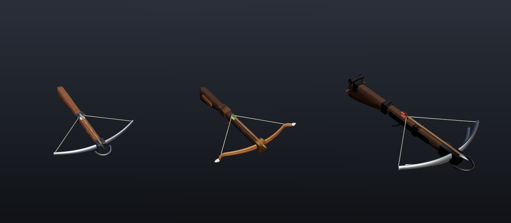
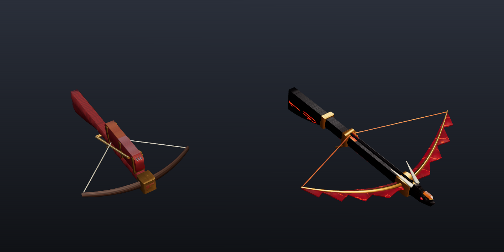

| | Item | Triangles | Size (studs, W × H × D) |
|---|---|---:|---|
| 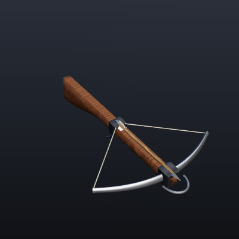 | **Crossbow**<br>Oak stock, steel prod, iron fittings, loaded bolt | 2,104 | 1.93 × 0.57 × 2.89 |
| 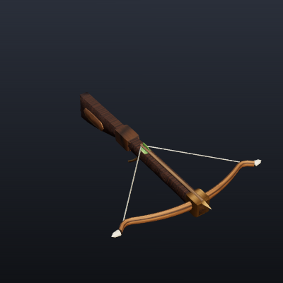 | **Hunter’s Crossbow**<br>Carved walnut, leather grip and cheek pads, laminated recurve prod with horn tips | 2,360 | 2.24 × 0.57 × 2.8 |
| 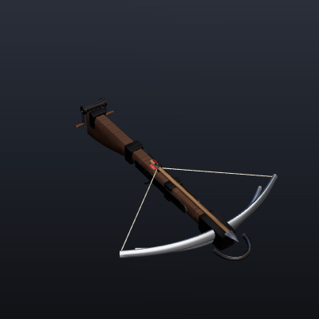 | **Siege Crossbow**<br>Oversized, iron-banded stock, double leaf-spring prod, windlass crank, broadhead quarrel | 3,560 | 2.64 × 0.67 × 3.8 |
| 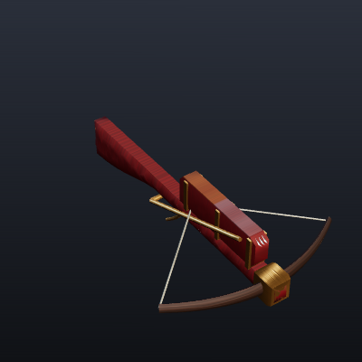 | **Repeating Crossbow**<br>Lacquered stock with a bolt magazine and brass cocking lever | 1,968 | 1.73 × 0.78 × 2.65 |
| 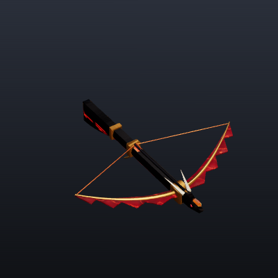 | **Dragonbane Arbalest**<br>Obsidian stock with glowing runes, dragon-wing prod, dragon-head muzzle, flaming bolt | 2,820 | 2.89 × 0.69 × 3.17 |

## Shields

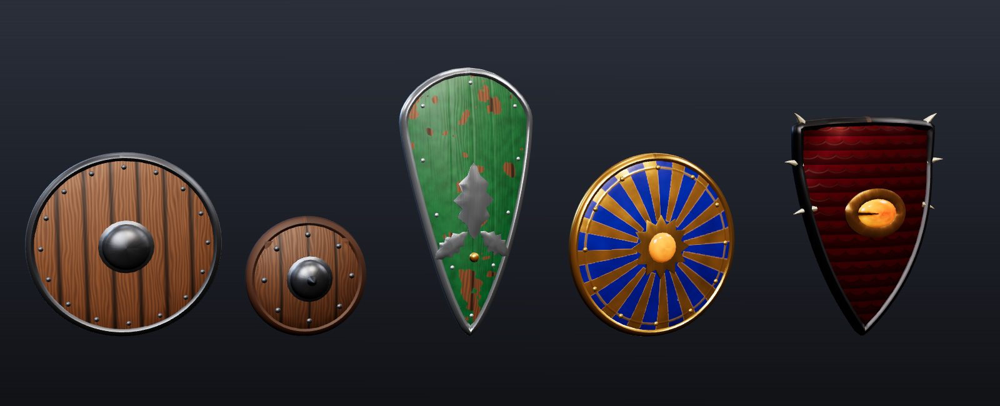
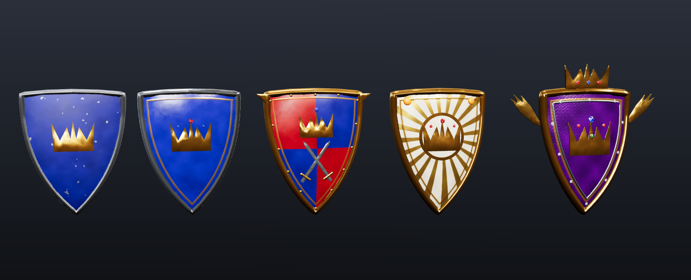

| | Item | Triangles | Size (studs, W × H × D) |
|---|---|---:|---|
| 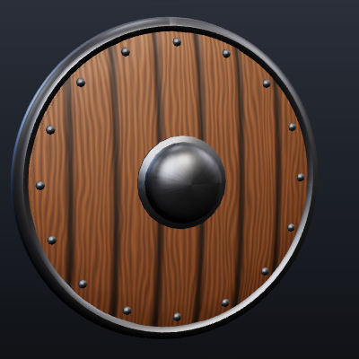 | **Shield**<br>Round plank shield, iron rim, boss and studs | 3,888 | 2.45 × 2.45 × 0.49 |
| 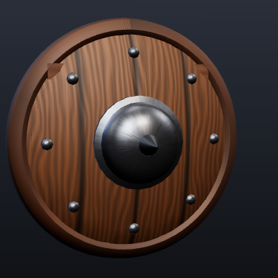 | **Oak Buckler**<br>Small oak buckler, leather-wrapped rim, spiked boss | 3,284 | 1.61 × 1.61 × 0.64 |
| 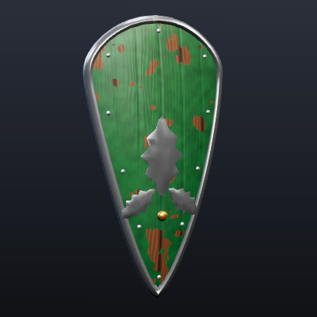 | **Warden’s Shield**<br>Green-painted kite shield (worn), silver oak-leaf emblem and acorn | 3,908 | 1.83 × 3.55 × 0.39 |
| 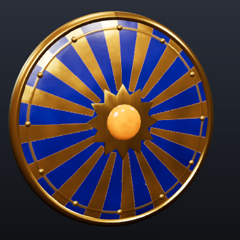 | **Sunburst Shield**<br>Blue enamel with gold sunburst, gold sun boss with a glowing stone | 3,864 | 2.44 × 2.44 × 0.41 |
| 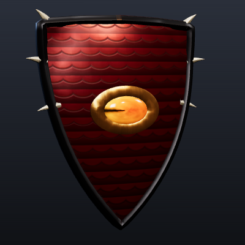 | **Dragonscale Aegis**<br>Red dragon-scale heater, black rim with horn spikes, dragon eye | 4,428 | 2.53 × 2.96 × 0.45 |
| 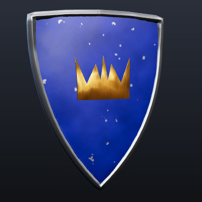 | **Royal Shield**<br>Blue heater shield (battle-worn) with a gold crown | 3,112 | 2.13 × 2.7 × 0.36 |
| 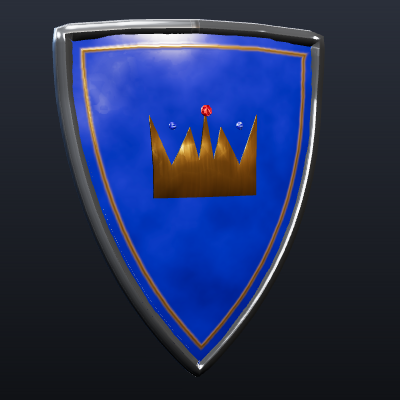 | **Polished Royal Shield**<br>Glossy enamel, gold inlaid border, polished silver rim, jeweled crown | 3,250 | 2.14 × 2.71 × 0.37 |
| 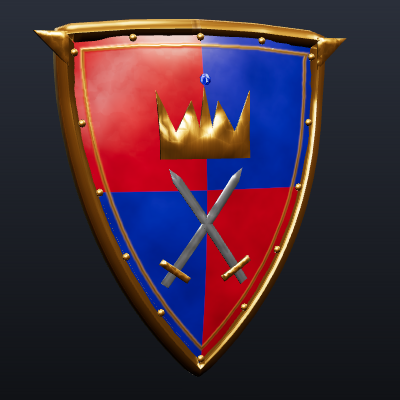 | **Kingsguard Royal Shield**<br>Quartered blue/red, crown over crossed swords, gold rim with rivets | 4,846 | 2.46 × 2.72 × 0.36 |
| 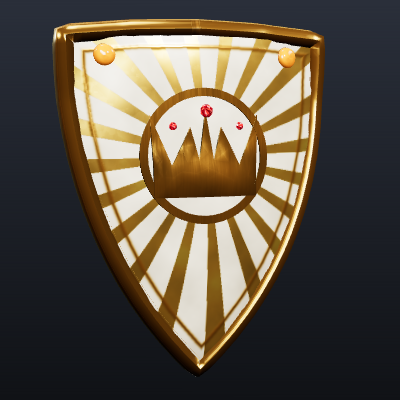 | **Sunward Royal Shield**<br>Ivory field with gold sun rays, haloed crown, glowing sun orbs | 4,114 | 2.15 × 2.72 × 0.37 |
| 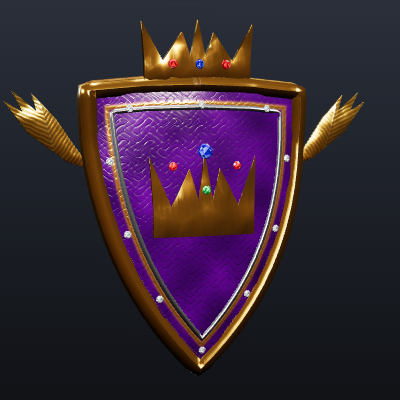 | **Sovereign Royal Shield**<br>Purple filigree field, double rim, crown crest on top, gold wings, gem-studded | 6,306 | 3.43 × 3.22 × 0.38 |

## Helmets

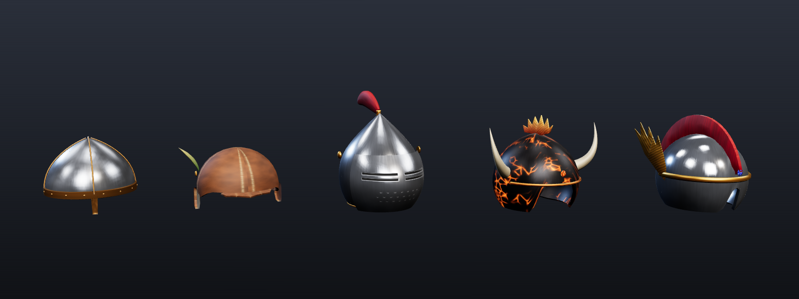

| | Item | Triangles | Size (studs, W × H × D) |
|---|---|---:|---|
| 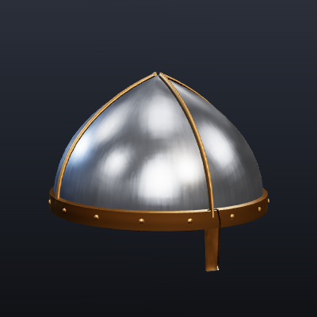 | **Helmet**<br>Nasal helm with bronze brow band, ribs and rivets | 3,420 | 1.49 × 1.19 × 1.6 |
| 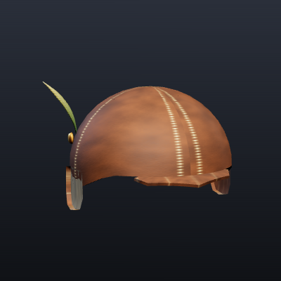 | **Scout’s Cap**<br>Stitched leather cap with fur-lined ear flaps, brim and feather | 2,252 | 1.73 × 1.07 × 1.57 |
| 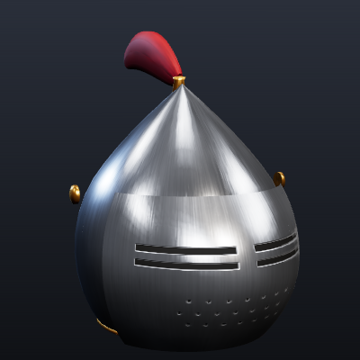 | **Knight’s Visor**<br>Pointed bascinet with a snouted visor (eye slits, breaths) and red plume | 4,732 | 1.52 × 1.93 × 1.87 |
| 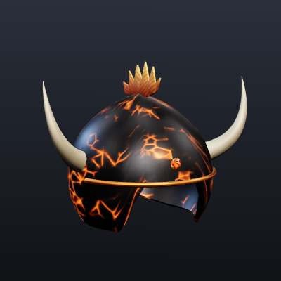 | **Ember Helm**<br>Black iron cracked with glowing embers, bone horns, flame crest | 4,002 | 2.13 × 1.57 × 1.55 |
| 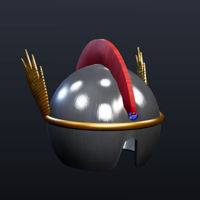 | **Champion’s Helm**<br>Polished Corinthian helm, gold feathered wings, red horsehair crest, sapphire | 4,578 | 1.75 × 1.55 × 1.86 |

## Rings

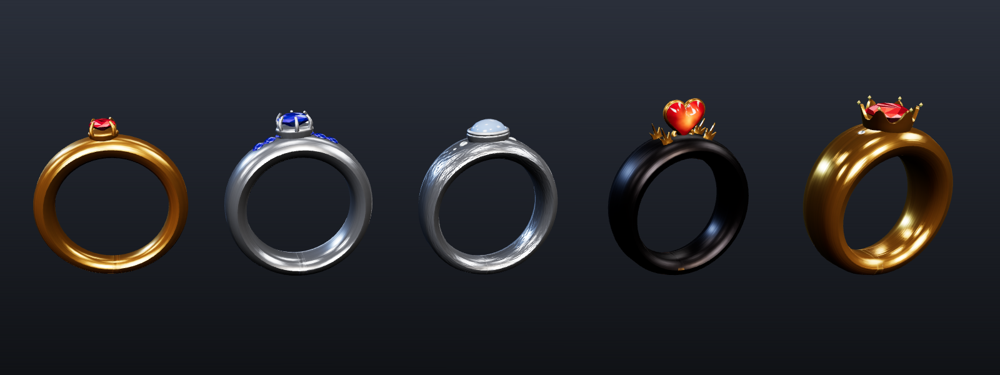

| | Item | Triangles | Size (studs, W × H × D) |
|---|---|---:|---|
| 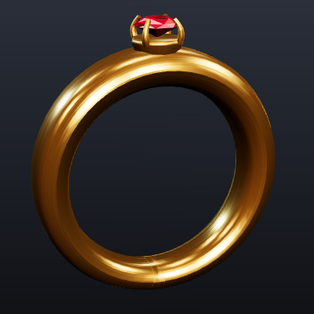 | **Ring**<br>Gold band, prong-set garnet | 1,478 | 0.55 × 0.61 × 0.13 |
| 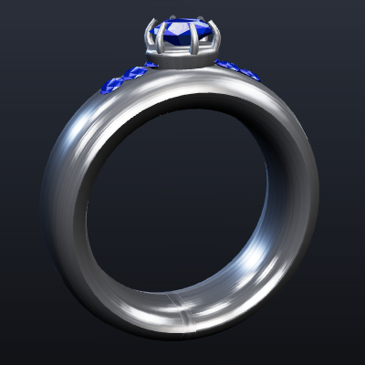 | **Sapphire Band**<br>Silver band, channel-set sapphires and a centre stone | 1,898 | 0.56 × 0.64 × 0.16 |
| 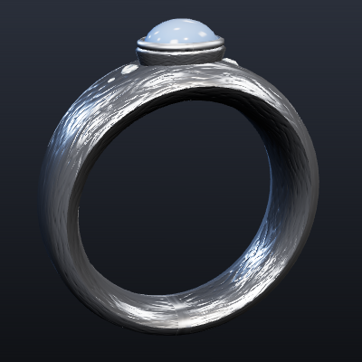 | **Moonstone Ring**<br>Engraved silver, moonstone cabochon in a bezel, diamond accents | 2,048 | 0.54 × 0.61 × 0.19 |
| 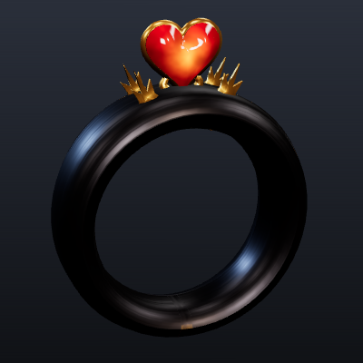 | **Emberheart Ring**<br>Blackened band, gold flames, glowing heart-shaped ember stone | 2,868 | 0.56 × 0.69 × 0.18 |
| 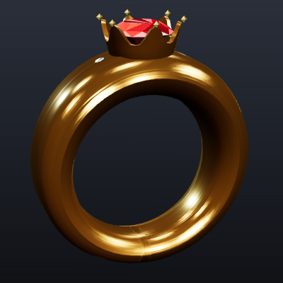 | **Ring of Kings**<br>Heavy gold band, crown-shaped setting with a large ruby, diamond shoulders | 2,082 | 0.59 × 0.68 × 0.24 |

## Amulets

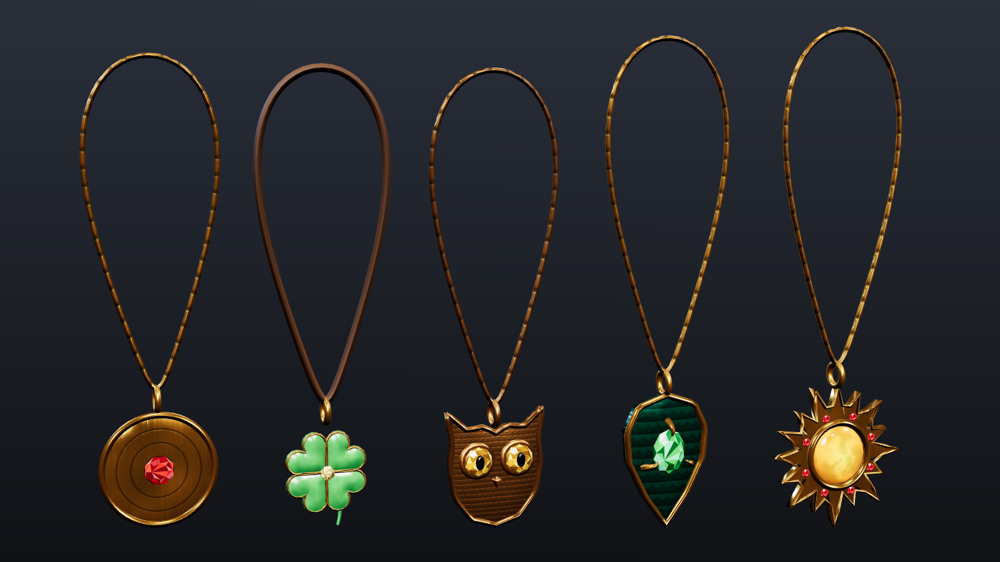
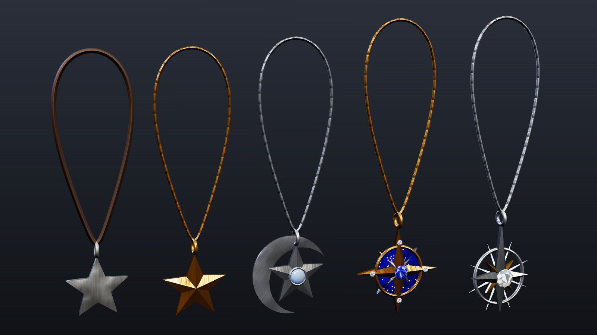

| | Item | Triangles | Size (studs, W × H × D) |
|---|---|---:|---|
| 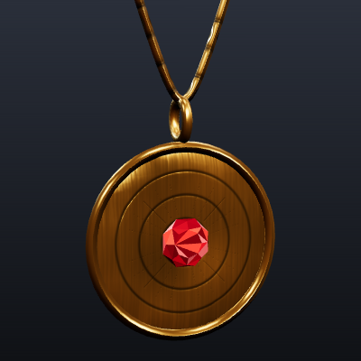 | **Amulet**<br>Engraved gold medallion with a ruby | 1,930 | 0.53 × 1.87 × 0.12 |
| 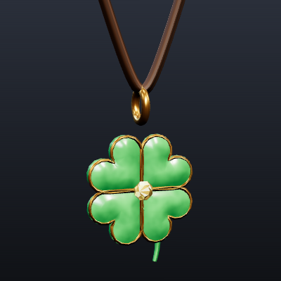 | **Lucky Charm**<br>Jade four-leaf clover on a leather cord | 3,382 | 0.54 × 1.83 × 0.12 |
| 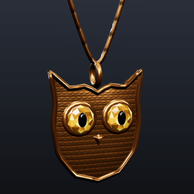 | **Owl-Eye Amulet**<br>Bronze owl with feathered texture and amber eyes | 2,724 | 0.53 × 1.81 × 0.15 |
| 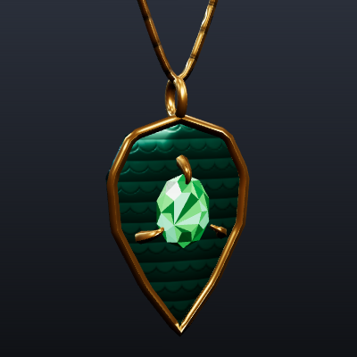 | **Wyrmscale Amulet**<br>Iridescent dragon-scale pendant, gold claws gripping an emerald | 2,046 | 0.53 × 1.93 × 0.15 |
| 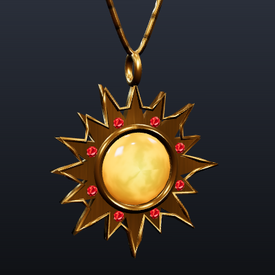 | **Heart of the Sun**<br>Gold sunburst, glowing sunstone ringed with rubies | 2,900 | 0.57 × 1.97 × 0.13 |
| 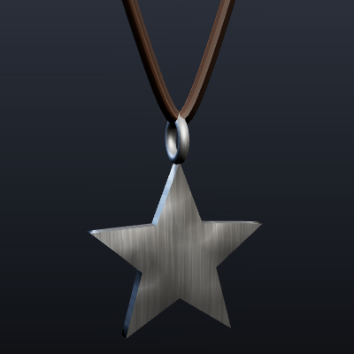 | **Star Amulet**<br>Pewter star on a cord | 1,248 | 0.54 × 1.81 × 0.12 |
| 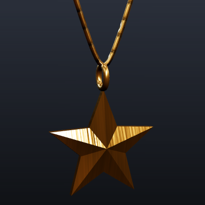 | **Polished Star Amulet**<br>Faceted polished-gold star | 1,064 | 0.53 × 1.82 × 0.12 |
| 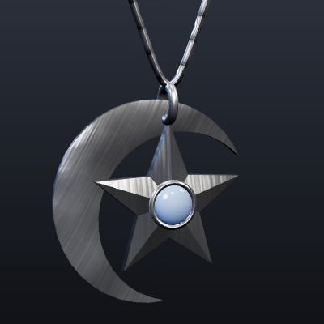 | **Moonstone Star Amulet**<br>Faceted silver star on a crescent moon, moonstone centre | 1,956 | 0.57 × 1.89 × 0.12 |
| 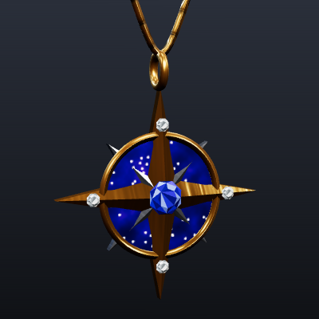 | **Celestial Star Amulet**<br>Layered gold/silver compass star over a starry enamel disc, sapphire | 2,186 | 0.6 × 2.0 × 0.13 |
| 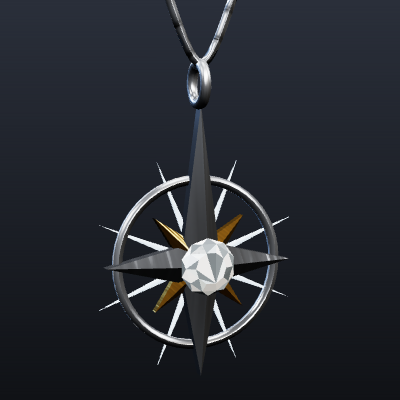 | **North Star Amulet**<br>Platinum north star with a halo, glowing rays and a diamond | 3,738 | 0.53 × 2.02 × 0.15 |

## Goblets

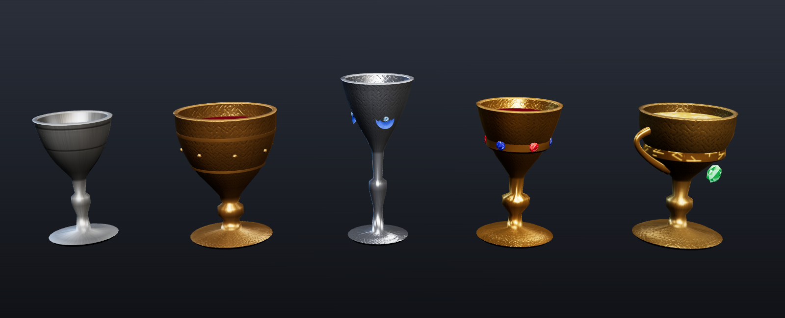

| | Item | Triangles | Size (studs, W × H × D) |
|---|---|---:|---|
| 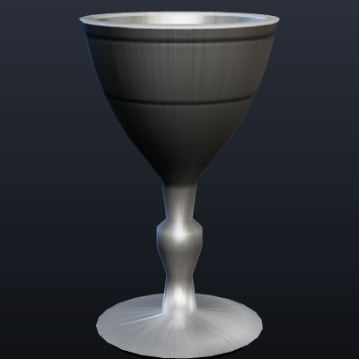 | **Goblet**<br>Turned pewter goblet | 1,200 | 0.58 × 0.96 × 0.58 |
| 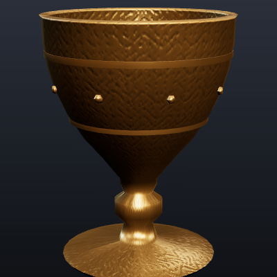 | **Feast Goblet**<br>Big engraved brass goblet with studded bands, full of wine | 2,000 | 0.78 × 1.01 × 0.78 |
| 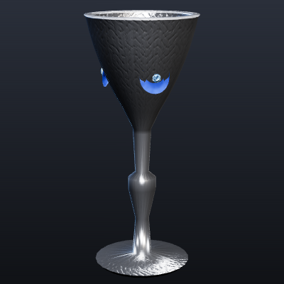 | **Moonlit Goblet**<br>Tall silver goblet, enamel crescent moons, glowing moonlight drink | 2,478 | 0.56 × 1.26 × 0.56 |
| 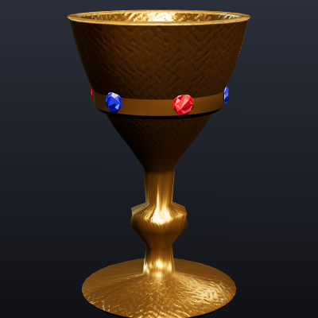 | **Royal Chalice**<br>Gold chalice, twisted stem, ruby/sapphire band, wine | 2,140 | 0.66 × 1.06 × 0.66 |
| 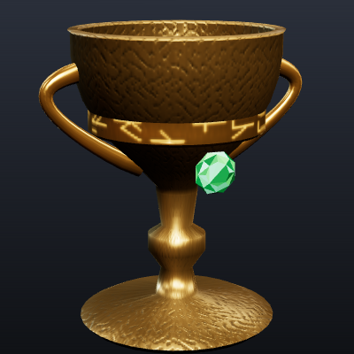 | **Grail of Ages**<br>Ancient gold grail with handles, glowing rune band, golden light inside, emerald | 2,630 | 0.93 × 1.01 × 0.72 |

## Crowns

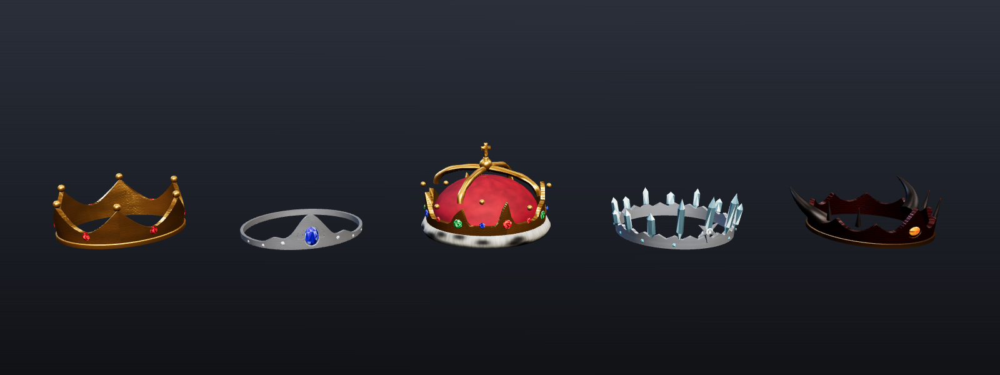

| | Item | Triangles | Size (studs, W × H × D) |
|---|---|---:|---|
| 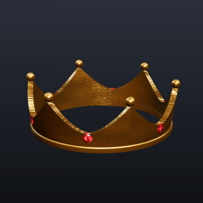 | **Crown**<br>Gold crown with ball-tipped points and rubies | 2,124 | 1.31 × 0.48 × 1.4 |
| 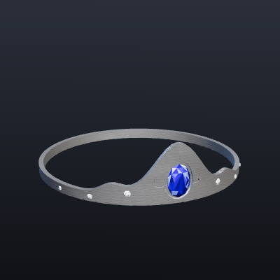 | **Silver Circlet**<br>Silver tiara with a sapphire, filigree and diamonds | 2,574 | 1.28 × 0.36 × 1.31 |
| 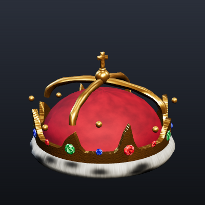 | **Jeweled Crown**<br>Arched crown with velvet cap, orb and cross, ermine trim, rubies/sapphires/emeralds | 4,560 | 1.38 × 0.96 × 1.38 |
| 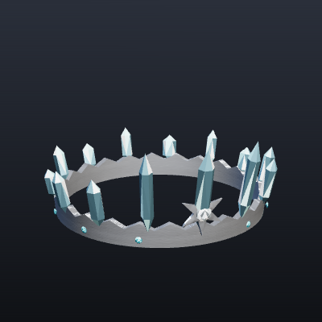 | **Frost Queen’s Crown**<br>Silver band with ice-crystal spires and a snowflake diamond | 2,214 | 1.36 × 0.57 × 1.42 |
| 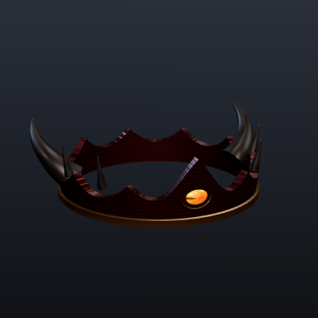 | **Dragon Crown**<br>Dragon-scale band, swept horns, glowing dragon eye | 3,352 | 1.53 × 0.44 × 1.31 |

## Potions

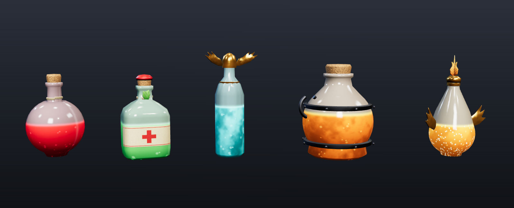

| | Item | Triangles | Size (studs, W × H × D) |
|---|---|---:|---|
| 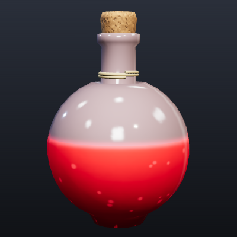 | **Potion**<br>Round flask of red potion, cork and twine | 1,664 | 0.68 × 1.0 × 0.68 |
| 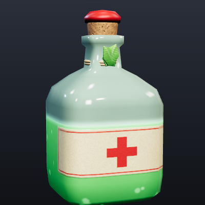 | **Healer’s Draught**<br>Square bottle of green draught, parchment label, wax seal, leaves | 1,964 | 0.56 × 1.0 × 0.56 |
| 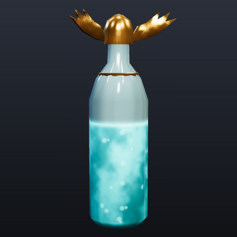 | **Swiftfoot Tonic**<br>Tall ribbed bottle of swirling teal, gold winged cap | 1,118 | 0.66 × 1.27 × 0.35 |
| 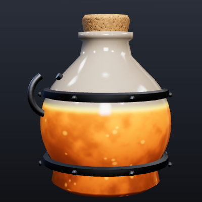 | **Giant’s Strength Brew**<br>Big iron-banded jug of bubbling orange brew with a handle | 2,124 | 0.98 × 1.12 × 0.91 |
| 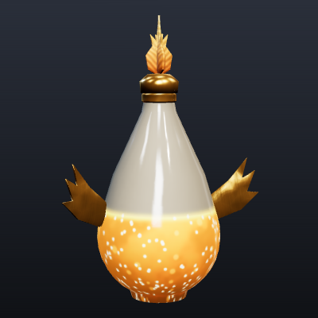 | **Phoenix Tears**<br>Teardrop bottle of glowing gold, phoenix wings and a flame stopper | 1,694 | 0.9 × 1.23 × 0.53 |

## Elixirs

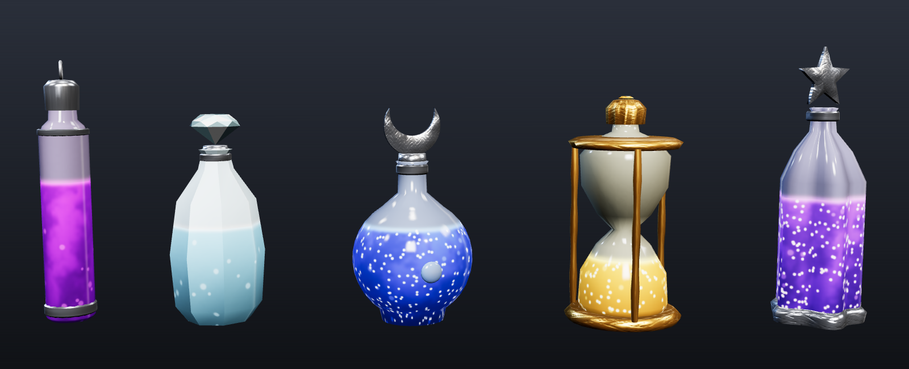

| | Item | Triangles | Size (studs, W × H × D) |
|---|---|---:|---|
| 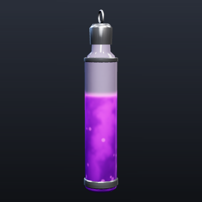 | **Elixir**<br>Slim vial of violet elixir, silver cap and bands | 794 | 0.26 × 1.33 × 0.26 |
| 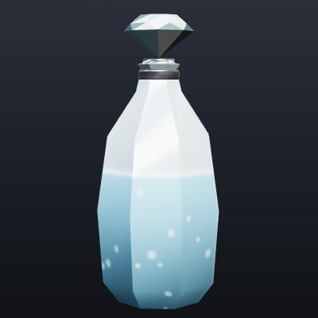 | **Elixir of Clarity**<br>Crystal-cut bottle of pale blue, diamond stopper | 246 | 0.48 × 1.06 × 0.48 |
| 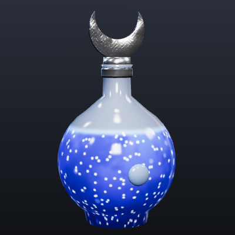 | **Moonwell Elixir**<br>Round flask of starry deep blue, crescent stopper, moonstone | 1,498 | 0.62 × 1.09 × 0.63 |
| 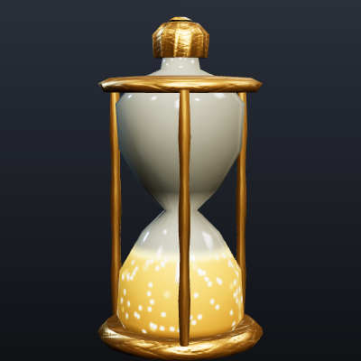 | **Elixir of Ages**<br>Hourglass bottle of golden sand-light in a gold frame with a gear cap | 1,796 | 0.6 × 1.15 × 0.6 |
| 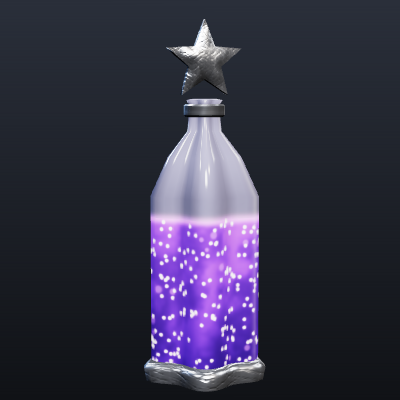 | **Starlight Elixir**<br>Star-section bottle of galaxy violet, silver star stopper | 1,210 | 0.46 × 1.4 × 0.48 |

## Regenerating

```
pip install numpy scipy pillow trimesh shapely triangle mapbox_earcut
python tools/weapongen/build_items.py assets/items                 # everything
python tools/weapongen/build_items.py assets/items Shields         # one category
python tools/weapongen/build_items.py assets/items RoyalShield     # one item
```

The definitions live in `items_crossbows.py`, `items_shields.py`, `items_headwear.py` (helmets and
crowns), `items_jewelry.py` (rings and amulets) and `items_vessels.py` (goblets, potions and elixirs).
`items.py` lists the categories. Each skin is one function, so a new tier is usually a copy of
its neighbour with different colors, gems or ornaments.
