# Weapon VFX

Heavy, animated effects for the 11 special weapons. Each weapon gets three layers:

- an **idle aura** that is always running, on display racks and when held
- a **swing** effect (trail plus extra particles) that plays when the player attacks
- a one-shot **burst** that plays on equip, or on hit if you trigger it

They're built from standard Roblox objects: ParticleEmitters, Trails, Beams and PointLights. A
small runtime animates them with crackling lightning, orbiting wisps, rotating light shafts and
flickering light.

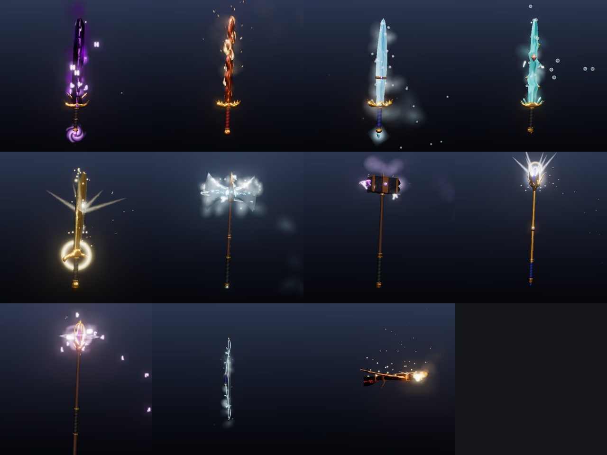

| Weapon | Vibe | Idle aura | Swing / burst |
|---|---|---|---|
| 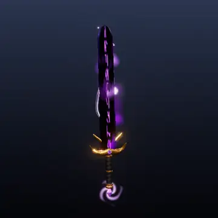 **Voidrender** | Tearing void | Dark void smoke, violet wisps, floating runes, sparks, purple lightning crackling along the blade, a vortex in the pommel | Wisp trail and a rune spray; burst: imploding vortex, shockwave, spark shower |
| 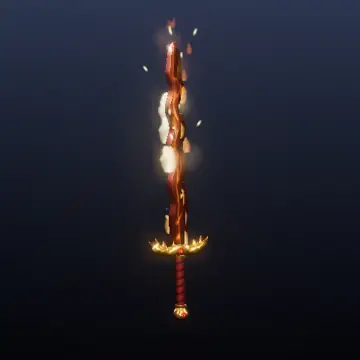 **Emberfang** | Living fire | Animated flames licking up the wavy blade, rising embers, heat smoke, a burning pommel, flickering firelight | Fire streak trail and flaring flames; burst: fireball, ember shower, shockwave |
| 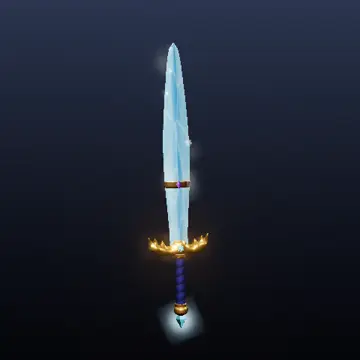 **Frostbrand** | Winter's breath | Cold mist sinking off the blade, drifting snowflakes, ice glints, falling ice shards | Frost trail and mist; burst: shattering ice shards, snow, shockwave |
| 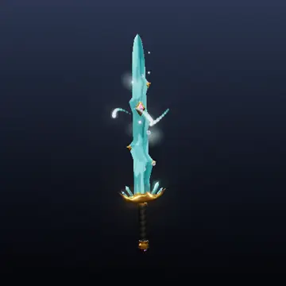 **Tidecrystal Shard** | Tidal currents | Three streams of droplets spiralling around the blade, rising bubbles, sea mist, sparkles | Water trail and spray; burst: splash with gravity, shockwave |
| 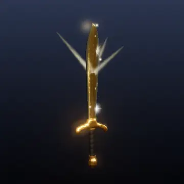 **Sunsteel Falchion** | Radiant sun | Rotating sun rays, star flares, a halo around the guard, floating golden motes | Golden trail and flares; burst: sunburst flare, mote shower, shockwave |
| 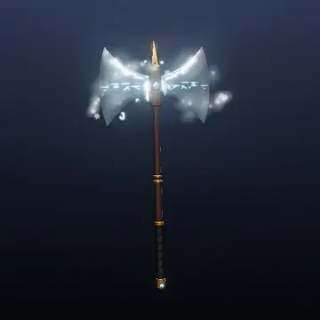 **Glacier Cleaver** | Blizzard | A snow-and-mist ring orbiting the head, frost runes, cold mist, a frost arc jumping between the blades | Wide frost trail and snow; burst: big ice-shard explosion, shockwave |
| 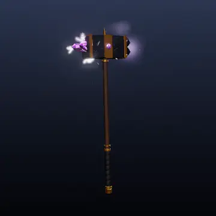 **Duskforged Warhammer** | Thunderstorm | Lightning arcing from the amethyst cluster across the head, electric crackles, falling sparks, a storm cloud overhead | Storm trail and crackles; burst: lightning blast, spark fountain, dust, a big shockwave |
| 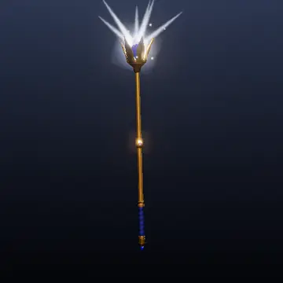 **Royal Sapphire Scepter** | Royal radiance | Light shafts fanning from the sapphire, sapphire sparkles, drifting gold dust, a halo and starlight on the finial | Sapphire-and-gold trail; burst: royal flash, gold shower, shockwave |
| 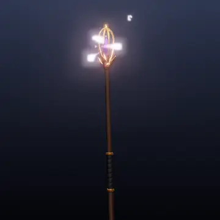 **Arcane Amethyst Staff** | Arcane power | Three arcane wisps orbiting the crystal with comet tails, a spinning spell circle, a vortex, rising runes | Arcane trail and orbs; burst: casting flash, rune burst, shockwave |
| 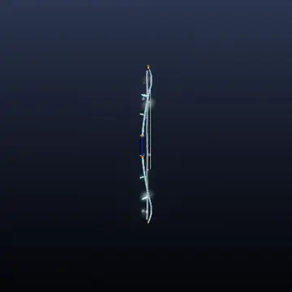 **Glacier Bow** | Frozen string | A frost-lit string, cold mist and snow drifting off the limbs, ice glints | Burst on the shot: frost blast, shockwave |
| 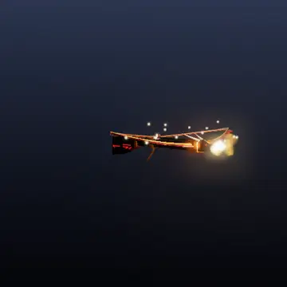 **Dragonbane Arbalest** | Dragon fire | The dragon head breathes fire and smoke, embers rise off the wings, a burning string, glowing runes | Burst on the shot: muzzle fireblast, ember spray, shockwave |

The previews come from a browser simulation of Roblox's particle rules, with bloom added
(`previews/*.mp4`, `*.webp`). In-game brightness depends on your Lighting settings (Bloom,
ambient, time of day). Effects read strongest in the evening or indoors.

## Performance

Effects are heavy to look at but cheap to run:

- **Particle counts.** Each weapon keeps about 30–110 particles alive at full quality while held,
  plus short bursts. That's comparable to a single campfire.
- **Client-side.** Everything runs on each player's own machine, so nothing replicates per frame.
- **Animation loop.** One Heartbeat loop drives all the weapons.
- **Distance culling.** Effects pause beyond `CullDistance`, 140 studs by default.
- **Display rate.** Weapons that aren't held (shop racks) run at 60% rate.
- **Mobile.** Phones and tablets automatically drop to half rate.

Change the settings at runtime with `WeaponVFX.Settings.X = ...`, then call `WeaponVFX.Refresh()`.

| Setting | Default | What it does |
|---|---|---|
| `Quality` | 1 | Multiplies every particle rate and burst count. Use 0.35 for low-end devices, 1.5 for extra heavy. |
| `DisplayRate` | 0.6 | Extra rate multiplier while a weapon is on display rather than held. |
| `CullDistance` | 140 | Effects pause when the camera is farther than this (studs). |
| `SwingDuration` | 0.35 | How long the trail and swing particles run per swing (seconds). |
| `FlipXZ` | false | Set to `true` if effects show up mirrored front-to-back on your imported meshes. |

## Setup in Studio

1. **Scripts.** Use Insert from File (right-click a service, then *Insert from File…*):
   - `roblox/WeaponVFX.rbxmx` goes into **ReplicatedStorage**. It's the module, with its
     `Presets` and `Textures`.
   - `roblox/WeaponVFXClient.rbxmx` goes into **StarterPlayer > StarterPlayerScripts**.
   - `roblox/WeaponVFXTool.rbxmx` goes **inside each special weapon's Tool**.

   If you use Rojo, map `WeaponVFX/` and the two `.lua` scripts to the same places instead.
2. **Tool names.** Name each Tool after its preset (`Voidrender`, `Emberfang`, …) and make the
   weapon's MeshPart its `Handle`. Or keep your own names and give the Tool a `VFXPreset` string
   attribute.
3. **Textures.** Upload every PNG in `textures/` with *View > Asset Manager > Bulk Import*. Then
   paste the asset ids into the **Textures** ModuleScript (inside `WeaponVFX`). Until you do,
   effects fall back to Roblox's built-in particle textures. They'll still show, but plainer and
   without the flipbook animation for flames, smoke, runes and shards.
4. **Display pieces.** For weapons on shop racks or counters, add the tag `WeaponVFX` to the
   MeshPart or Model (Properties > Tags) and a `VFXPreset` attribute. They get the idle aura.

When those steps are done, swings play when the player attacks (`Tool.Activated`), and the burst
plays on equip. To fire the burst on a hit, add this to your damage code (server):

```lua
tool:SetAttribute("VFXBurst", (tool:GetAttribute("VFXBurst") or 0) + 1)
```

### Using the module directly

```lua
local WeaponVFX = require(game.ReplicatedStorage.WeaponVFX)
local vfx = WeaponVFX.Attach(handle, "DuskforgedWarhammer")  -- idle aura starts
vfx:Swing()            -- trail + swing particles
vfx:Burst()            -- impact burst (vfx:Burst(2) for double)
vfx:SetEnabled(false)  -- pause
vfx:Destroy()          -- remove everything it created
```

The module puts its emitter parts (invisible, massless, welded) and Attachments on the handle.
It sizes them from the mesh, so a weapon you scale up or down in Studio keeps its effects lined
up.

## Files

| Path | What |
|---|---|
| `WeaponVFX/init.lua` | The runtime module |
| `WeaponVFX/Presets.lua` | Generated effect definitions; tweak values here or in the generator |
| `WeaponVFX/Textures.lua` | Asset ids for the uploaded textures |
| `WeaponVFXClient.client.lua`, `WeaponVFXTool.server.lua` | The client loader and the per-Tool script |
| `roblox/*.rbxmx` | The same scripts packaged for Insert from File |
| `textures/*.png` | 21 white, tintable sprites, flipbooks and beam/trail strips |
| `presets.json` | The presets as data (used by the previewer) |
| `previews/` | Animated previews (`.mp4`, `.webp`) and stills |

## Editing and regenerating

Everything is generated by `tools/vfxgen/`:

```
python tools/vfxgen/textures.py assets/vfx/textures     # particle textures
python tools/vfxgen/presets.py assets                   # Presets.lua + presets.json
python tools/vfxgen/bundle.py                           # .rbxmx files
python tools/vfxgen/tests/run_tests.py path/to/luau     # run the module against a strict Roblox mock
sh tools/vfxgen/render_previews.sh assets/vfx/previews anim
```

To add a weapon, add an entry to `presets()` in `tools/vfxgen/presets.py`. Positions are written in
the weapon's model coordinates (the numbers in `tools/weapongen`) and converted automatically. The
tests run every preset through attach, idle animation, swing, burst, distance culling, held vs.
display, a resized and mirrored handle, and cleanup.
