# Weapons

Twelve weapons remade from the shop screenshot. Each one is detailed but light enough for games:

- **One mesh with one material per weapon**, so each costs a single draw call. Shape comes from
  efficient geometry (1,100–3,800 triangles each, 25,198 for all 12). Fine detail comes from
  textures: leather wraps, wood grain, engraving, crystal facets, runes.
- **Consistent sizes** against a default R15 character (about 5.2 studs tall): short swords are
  about 3.5 studs, swords about 4–4.5, heavy weapons about 5, staffs 5.6–6.2.
- **PBR textures** at 1024×1024 (Roblox's maximum): color, metalness, roughness and normal maps,
  plus a glow (emissive) map on weapons with glowing parts.

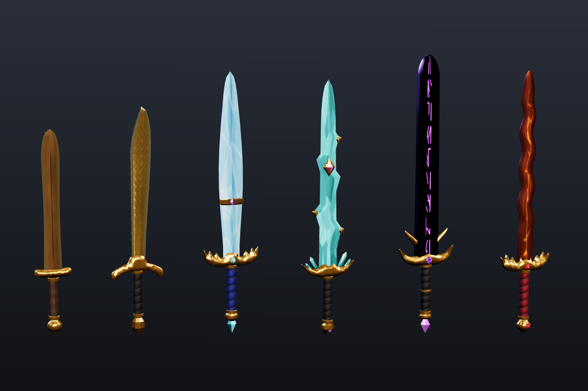
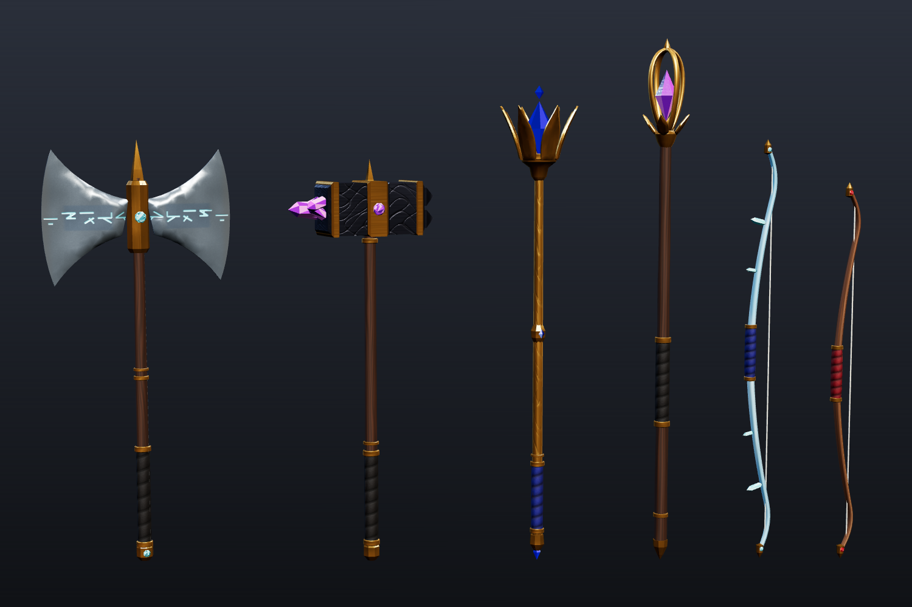

| Preview | Weapon | Triangles | Size (studs, W × H × D) |
|---|---|---:|---|
| 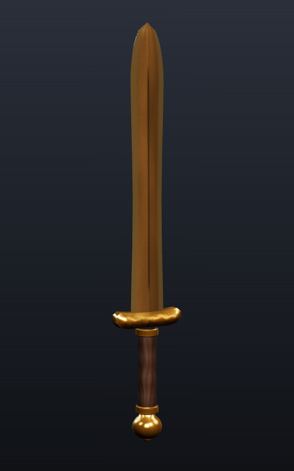 | **Bronze Gladius**<br>Short sword: honed bronze blade, gold guard, ridged wooden grip | 1,536 | 0.58 × 3.28 × 0.23 |
| 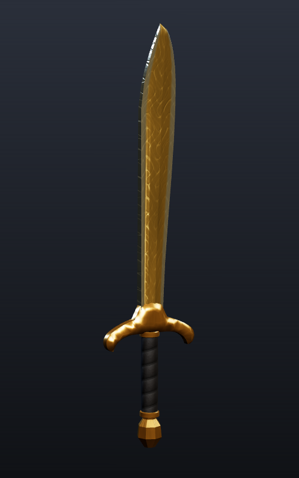 | **Sunsteel Falchion**<br>Single-edged golden falchion with an etched blade and faceted pommel | 1,330 | 0.85 × 3.63 × 0.22 |
| 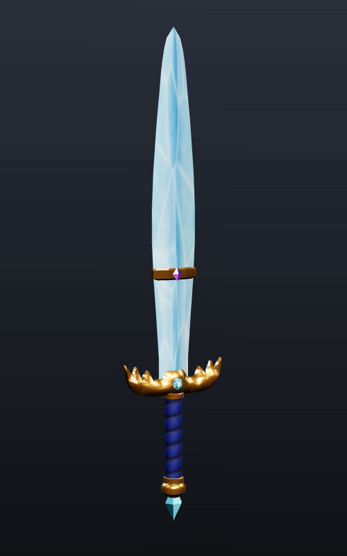 | **Frostbrand**<br>Leaf-bladed ice sword with a gold clasp, crown guard and ice-crystal pommel | 1,344 | 0.92 × 4.18 × 0.22 |
| 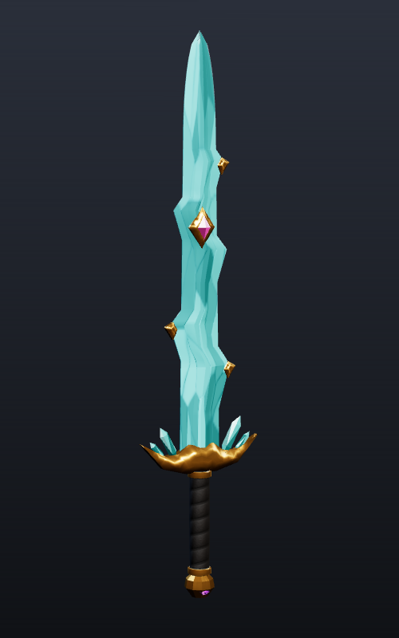 | **Tidecrystal Shard**<br>Jagged teal crystal blade, gold-capped barbs, pink gem, crystals growing from the guard | 3,090 | 0.94 × 4.05 × 0.21 |
| 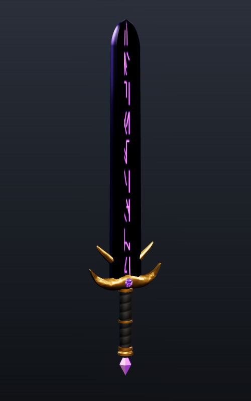 | **Voidrender**<br>Wide obsidian blade with glowing violet runes and gold claws | 2,026 | 1.0 × 4.45 × 0.19 |
| 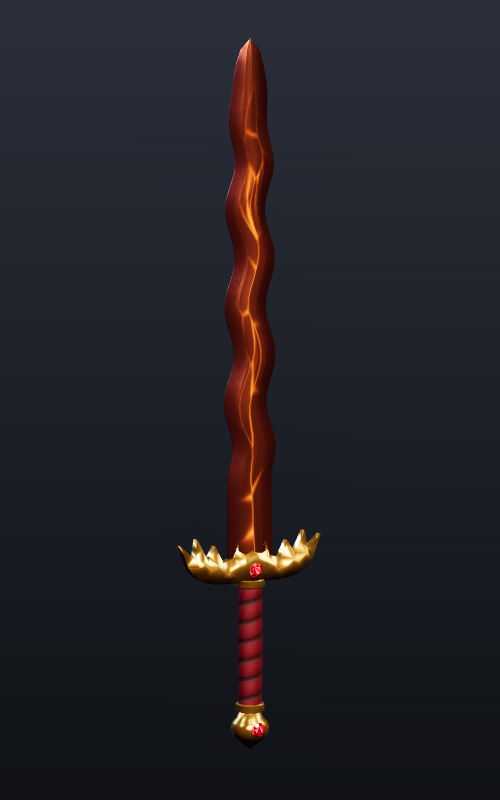 | **Emberfang**<br>Wavy copper flamberge with glowing ember cracks and a flame guard | 2,128 | 0.94 × 4.2 × 0.24 |
| 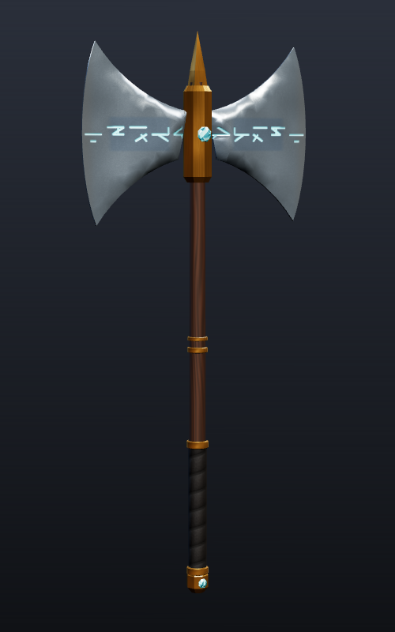 | **Glacier Cleaver**<br>Double-bit frost-steel axe with glowing runes and a cyan gem | 2,416 | 2.22 × 5.0 × 0.3 |
| 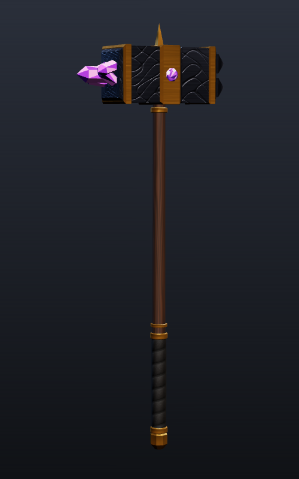 | **Duskforged Warhammer**<br>Gunmetal hammer: studded striking face, amethyst cluster on the back | 1,116 | 1.76 × 4.77 × 0.62 |
| 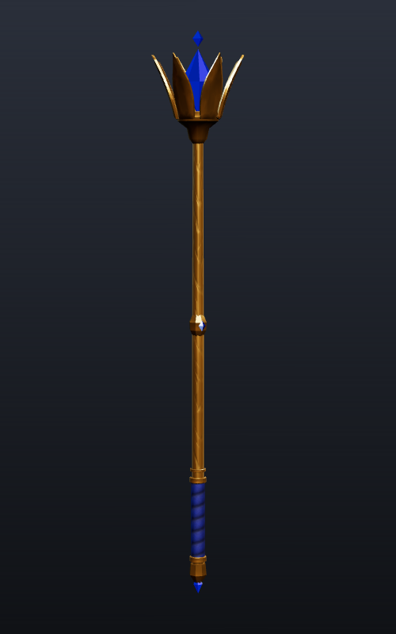 | **Royal Sapphire Scepter**<br>Gold scepter with a six-prong crown holding a large sapphire | 2,944 | 0.79 × 5.62 × 0.91 |
| 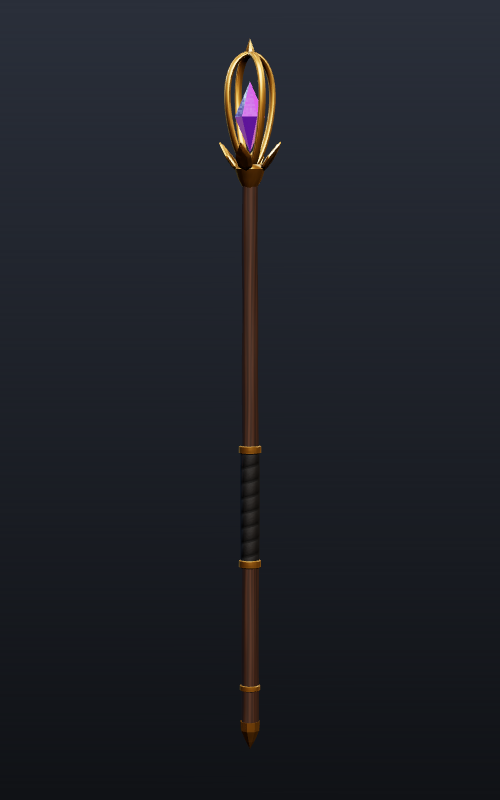 | **Arcane Amethyst Staff**<br>Gnarled wooden staff with a gold cage around an amethyst crystal | 3,824 | 0.48 × 6.16 × 0.48 |
| 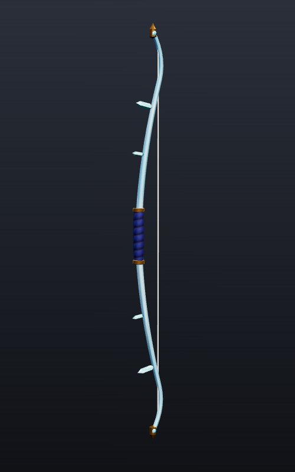 | **Glacier Bow**<br>Ice recurve bow with crystal spines | 1,770 | 0.41 × 5.0 × 0.15 |
| 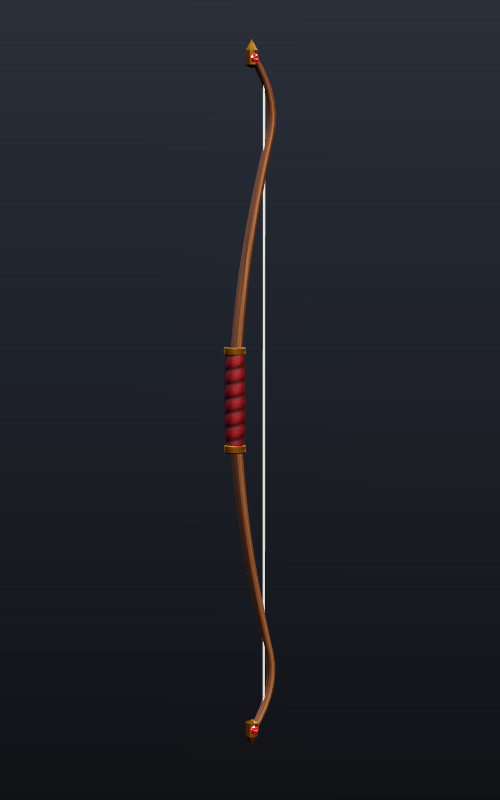 | **Hunter's Recurve Bow**<br>Laminated wooden recurve with a crimson grip (the bow leaning on the red post) | 1,674 | 0.35 × 4.5 × 0.15 |

Close-ups: [hilts 1](previews/hilts_1.png) · [hilts 2](previews/hilts_2.png) ·
[heads 1](previews/heads_1.png) · [heads 2](previews/heads_2.png)

## Importing into Roblox Studio

1. Open the **Import 3D** dialog (in the Home or Avatar tab) and pick `<Weapon>/<Weapon>.glb`.
   Keep texture import on.
2. Each weapon comes in as a single MeshPart, standing upright (blade or head pointing +Y).
3. Check that the MeshPart has a **SurfaceAppearance**. If the importer didn't create one, add a
   SurfaceAppearance yourself and upload the maps from `<Weapon>/textures/`:
   `ColorMap` = `_color.png`, `MetalnessMap` = `_metalness.png`, `RoughnessMap` = `_roughness.png`,
   `NormalMap` = `_normal.png`.
4. **Glow:** every weapon except the gladius and falchion also ships an `_emissive.png` covering
   the runes on Voidrender and Glacier Cleaver, Emberfang's ember cracks, the ice and crystal
   blades, and the gems. If your SurfaceAppearance has emissive properties, use that map. If not,
   the glowing parts are already painted bright in the color map, so they still stand out.

### Using one as a Tool

Make the MeshPart the Tool's `Handle`, then set the grip from `WeaponGrips.lua`, a ModuleScript that
gives each weapon's hand position relative to the mesh centre:

```lua
local WeaponGrips = require(path.to.WeaponGrips)
tool.Grip = CFrame.new(WeaponGrips.Voidrender)
```

If a weapon sits rotated in the hand, multiply in a rotation, e.g.
`CFrame.new(offset) * CFrame.Angles(math.rad(90), 0, 0)`.

## Regenerating / making more

Everything is generated from code in `tools/weapongen/`:

```
pip install numpy scipy pillow trimesh shapely triangle mapbox_earcut
python tools/weapongen/build.py assets/weapons            # all weapons
python tools/weapongen/build.py assets/weapons Voidrender # just one
```

- `weapons.py`: one function per weapon (shapes, sizes, colors). Add a new function to
  `WEAPONS` to make a new weapon.
- `core.py`: the building blocks (blades, inflated flat shapes for guards and axe heads, lathed
  shafts and pommels, swept tubes, faceted gems), the texture painters and the atlas packer.
- `preview/`: the renderer used for the images above (`npm i` in that folder, then `./render.sh`).
